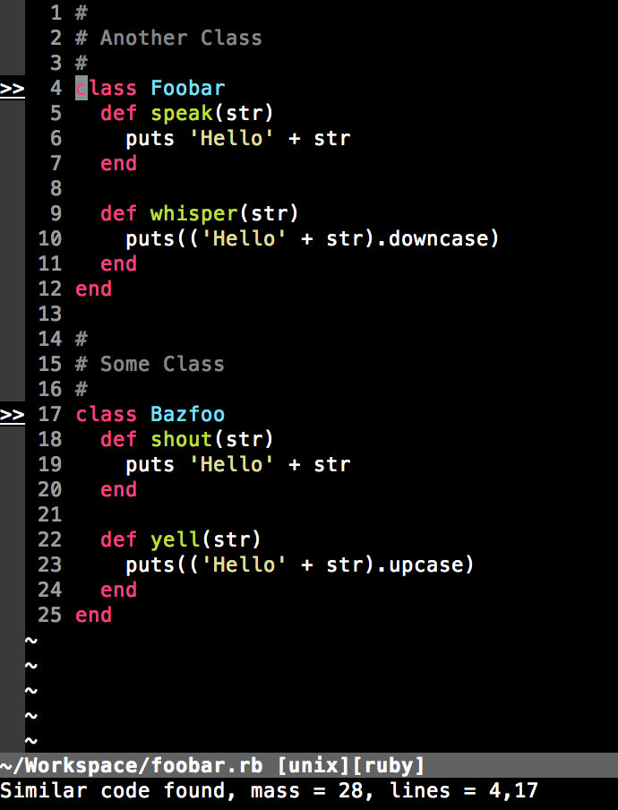

Vim Flay
========

Vim Flay analyzes structural similarities within Ruby code and reports code
that is structured similar. This is a great way to find code that is prime for
refactoring. Ruby is well known for DRY code practices and *vim-flay* helps
locate code that appears to violate the DRY principle.

Vim Flay attempts to be unobtrusive yet informative. The plugin will mark a
number of lines where code is too similar and when the cursor is placed on
line with a mark there will be a subtle status message within the command bar.

Note, *vim-flay* ignores the naming of variables and functions and only
analyzes code structure for similarities.



Requirements
------------

First and foremost, *vim-flay* requires the installation of *flay* which is a
Ruby gem. Assuming you have Ruby installed, you can install *flay* like so,

```bash
$ gem install flay
```

Secondly, *vim-flay* assumes you have compiled *vim* with Ruby support. Many
*vim* installations come with Ruby support already enabled. You can check your
installation with the following command,

```bash
$ vim --version | grep ruby
```

If you see `+ruby` then you are good to go. If not, you can check your operating
system's requirements for installing *vim* with Ruby support. If you are an
Ubuntu user you may not have Ruby support out of the box, but you can easily
install a version of *vim* that does,

```bash
$ sudo apt-get install install vim-nox
```

Finally, *vim-flay* requires `+signs` support. Vim Flay uses signs to mark
lines within Ruby source code. Most installations of *vim* have sign support
but you can check your installation to be sure,

```bash
$ vim --version | grep sign
```

If you see `+signs` in the output there is no problem.

Installation
------------

With the requirements out of the way all you need to do is install the plugin
itself. If you are a Pathogen user you are in luck because this plugin is
Pathogen friendly. All you need to do is drop this plugin in your `bundle`
folder and you are good to go.

```bash
$ cd ~/.vim/bundle/
$ git clone https://github.com/prophittcorey/vim-flay.git
```

If you don't have Pathogen set up I highly recommend you check it out. It saves
a lot of headaches when installing *vim* plugins.

Check out Pathogen [here](https://github.com/tpope/vim-pathogen).

Usage
-----

By default there are no mappings. It's up to you to make your own mapping. I
use the following:

    nnoremap <Leader>f :Flay<CR>

The `Flay` command processes the current file and marks any lines with similar
code.

There are a few other useful commands,

1. `FlayClear` clears all marks
2. `FlayToggle` toggles between Flay and FlayClear
3. `FlayList` lists all bad line numbers in the current file

For help within *vim*, use `:help vimflay`.

Configuration
-------------

There are some configurable settings in *vim-flay* which can help simplify the
usage of the plugin. Below are all settings with their defaults shown.

1. `g:flay_on_open` defaults to 0, change to 1 to enable
2. `g:flay_on_save` defaults to 0, change to 1 to enable
3. `g:flay_minimum_mass` defaults to 6, change to any number you prefer
4. `g:flay_piet_text` defaults to ">>", change it to anything you prefer

A note on `g:flay_minimum_mass`. The default is a number I feel comfortable with
but you may find it to be too sensitive to similarities. If that is the case you
may prefer a number like 10 or 16. You can mess with different numbers until you
find a number which fits your preference.

All of these options are configurable in your `.vimrc` file. Below are a few
examples of what that would look like,

```viml
let g:flay_on_open=0
let g:flay_on_save=1
let g:flay_minimum_mass=10
let g:flay_piet_text="✗"
```

License
-------

    The MIT License (MIT)

    Copyright (c) 2015, Corey Prophitt.

    Permission is hereby granted, free of charge, to any person obtaining a
    copy of this software and associated documentation files (the "Software"),
    to deal in the Software without restriction, including without limitation
    the rights to use, copy, modify, merge, publish, distribute, sublicense,
    and/or sell copies of the Software, and to permit persons to whom the
    Software is furnished to do so, subject to the following conditions:

    The above copyright notice and this permission notice shall be included in
    all copies or substantial portions of the Software.

    THE SOFTWARE IS PROVIDED "AS IS", WITHOUT WARRANTY OF ANY KIND, EXPRESS OR
    IMPLIED, INCLUDING BUT NOT LIMITED TO THE WARRANTIES OF MERCHANTABILITY,
    FITNESS FOR A PARTICULAR PURPOSE AND NONINFRINGEMENT. IN NO EVENT SHALL THE
    AUTHORS OR COPYRIGHT HOLDERS BE LIABLE FOR ANY CLAIM, DAMAGES OR OTHER
    LIABILITY, WHETHER IN AN ACTION OF CONTRACT, TORT OR OTHERWISE, ARISING
    FROM, OUT OF OR IN CONNECTION WITH THE SOFTWARE OR THE USE OR OTHER
    DEALINGS IN THE SOFTWARE.
