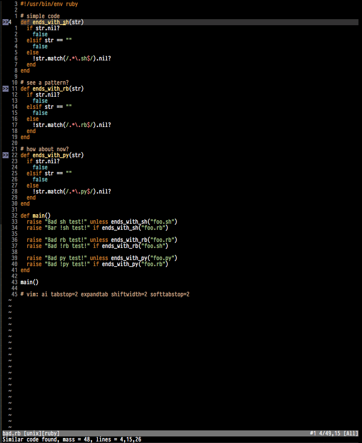
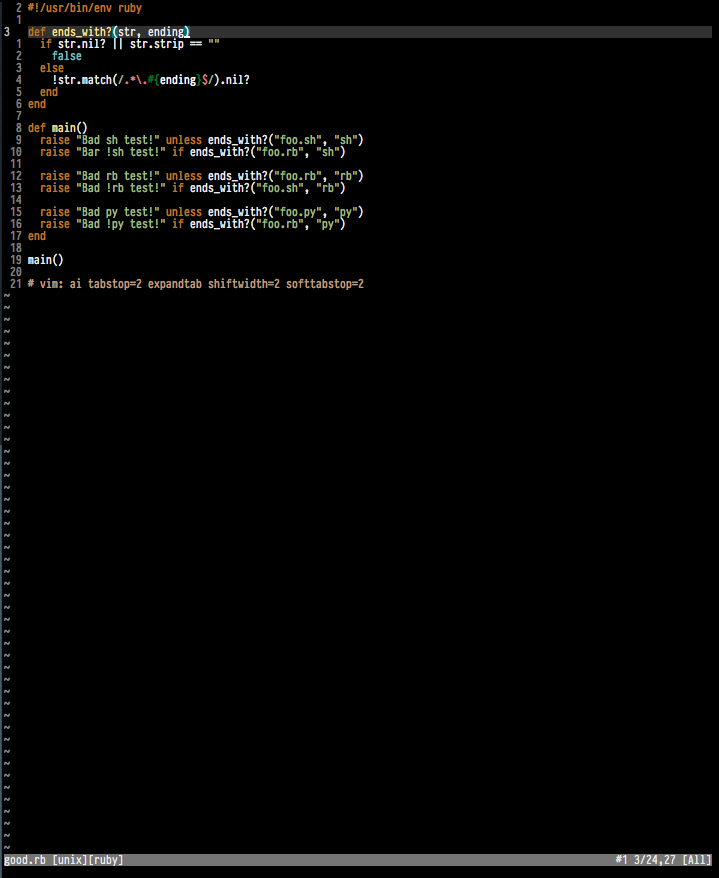

Vim Flay
========

VimFlay analyzes structural similarities within Ruby code and reports on code
that is _too_ similar. Ruby is well known for the advocating of DRY code and
this plugin does just that-- screams at you when your code isn't DRY.

The Vim plugin relies on the gem `flay` which was written by Ryan Davis.

    https://github.com/seattlerb/flay

VimFlay attempts to be unobtrusive yet informative. The plugin will sign a
number of lines where code is non-DRY and when the cursor is placed on line
with a sign there will be a subtle status message within the command bar.

Below is an example of non-DRY code and VimFlay's complaints:

Refactored code where the screams stop:

------------
Installation
------------

In order to use vim-flay your installation of Vim must support +ruby and
+signs. If you are unsure if your version of Vim supports these you can
find out via `vim --version`.

If you don't have pathogen or vundle, stop what you're doing and setup one of
them first. You'll thank me some day.

I assume you have an installation of Ruby and are able to install gems. If not
you need to seek out how, I recommend RVM to manage Ruby installations.

First and foremost you need to have the Flay gem installed

    $ gem install flay

Now you need the vim-flay plugin. The plugin is Pathogen compatible. You can
grab the plugin and put it in your bundle folder and you're done.

    $ cd ~/.vim/bundle/
    $ git clone https://github.com/prophittcorey/vim-flay.git

-------
License
-------

The MIT License (MIT)

Copyright (c) 2014, Corey Prophitt.

Permission is hereby granted, free of charge, to any person obtaining a copy
of this software and associated documentation files (the "Software"), to deal
in the Software without restriction, including without limitation the rights
to use, copy, modify, merge, publish, distribute, sublicense, and/or sell
copies of the Software, and to permit persons to whom the Software is
furnished to do so, subject to the following conditions:

The above copyright notice and this permission notice shall be included in
all copies or substantial portions of the Software.

THE SOFTWARE IS PROVIDED "AS IS", WITHOUT WARRANTY OF ANY KIND, EXPRESS OR
IMPLIED, INCLUDING BUT NOT LIMITED TO THE WARRANTIES OF MERCHANTABILITY,
FITNESS FOR A PARTICULAR PURPOSE AND NONINFRINGEMENT. IN NO EVENT SHALL THE
AUTHORS OR COPYRIGHT HOLDERS BE LIABLE FOR ANY CLAIM, DAMAGES OR OTHER
LIABILITY, WHETHER IN AN ACTION OF CONTRACT, TORT OR OTHERWISE, ARISING FROM,
OUT OF OR IN CONNECTION WITH THE SOFTWARE OR THE USE OR OTHER DEALINGS IN
THE SOFTWARE.
